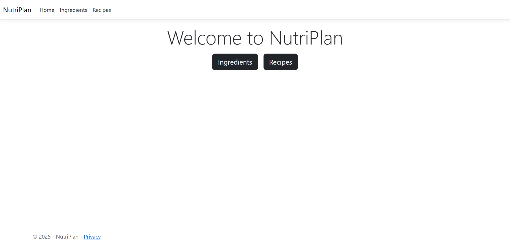
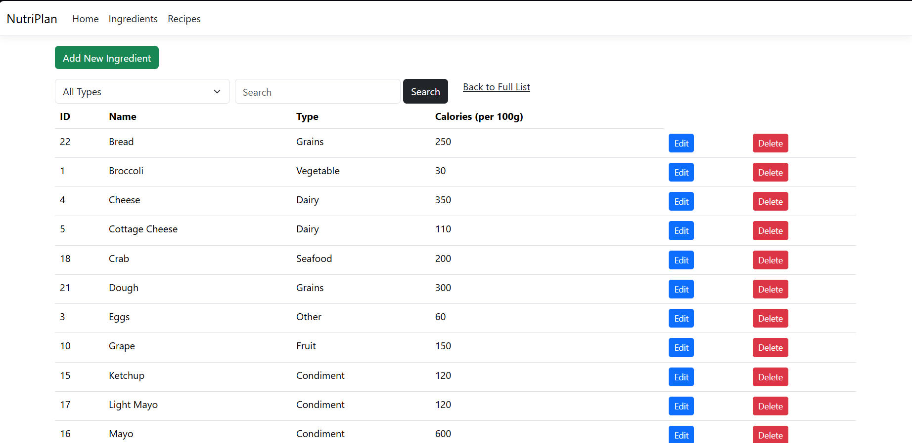
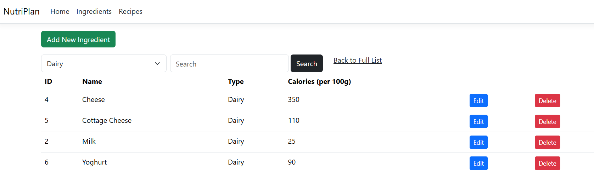
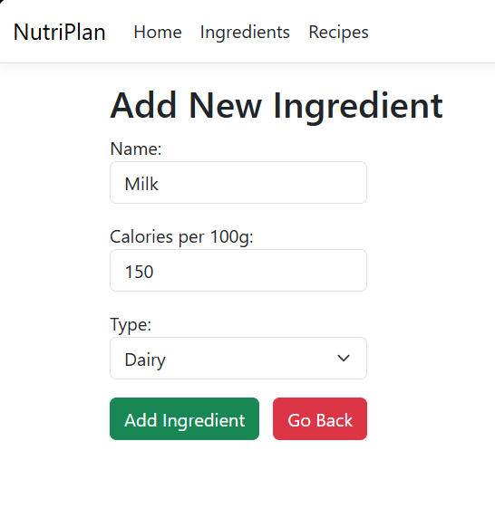
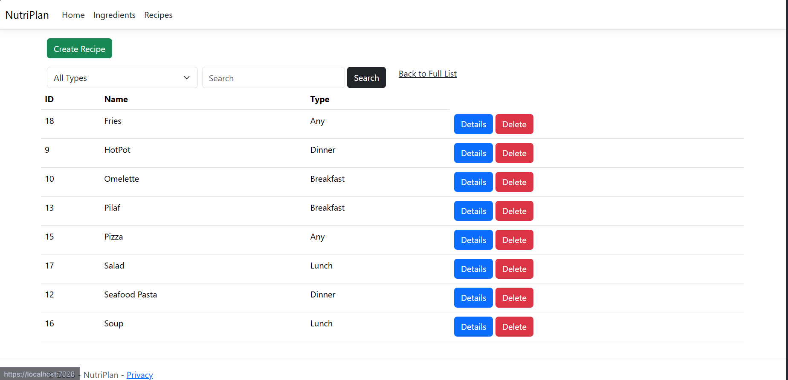
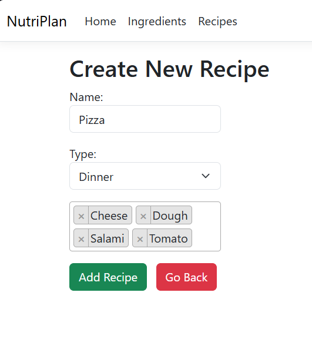

# NutriPlan
 A personal learning project in ASP.NET MVC 

## Features 
 - Create, edit, and delete ingredients
 - Create recipes using ingredients, view and delete them
 - Search functionality
 - Filter functionality

### Home Page

### Ingredient Page

### Recipes Page

## Technologies
  - ASP.NET MVC
  - Entity Framework
  - SQL Server
  - C#, HTML, CSS, Bootstrap

## Notes
This project was built for learning purposes. While AI has been used for guidance and learning, **all code in this project was written manually** following tutorials and documentation.
